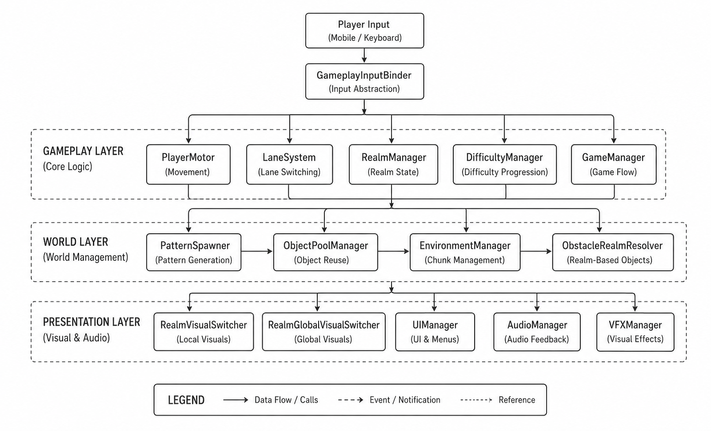
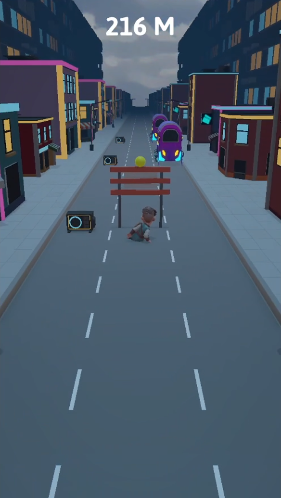
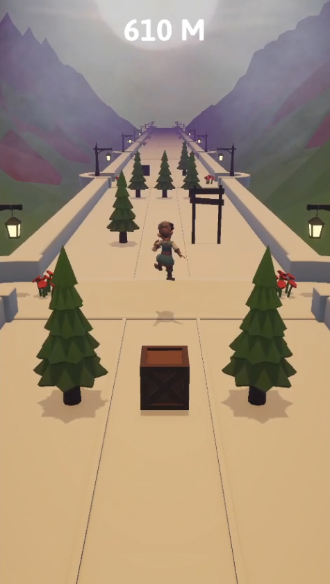
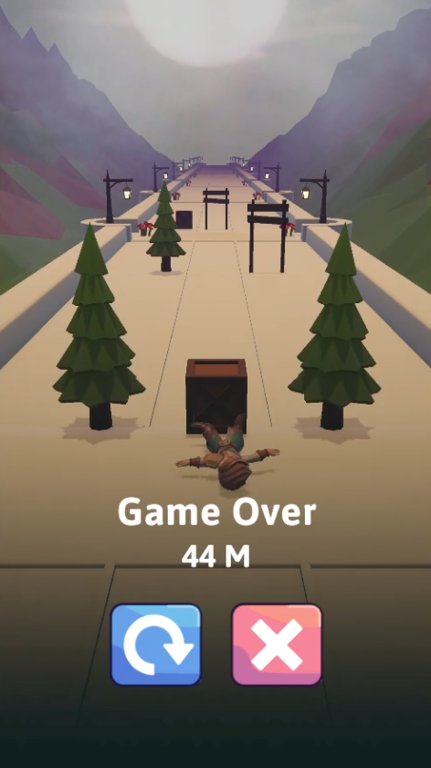
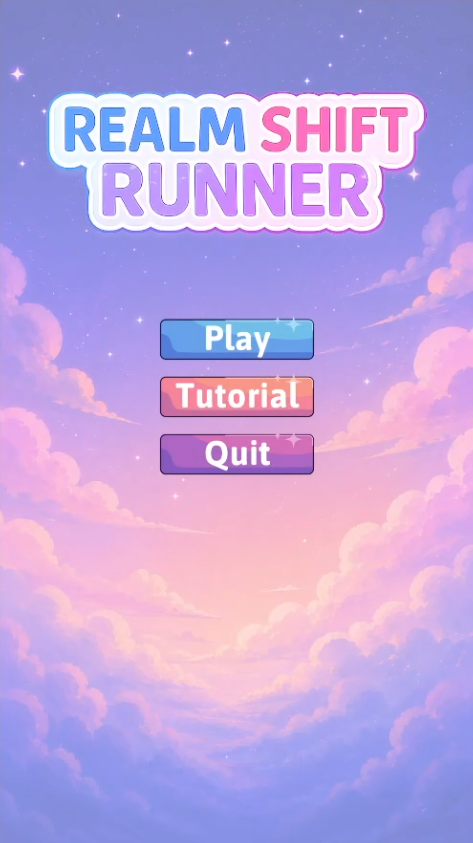

<p align="center">
  
</p>

<h1 align="center">Realm Shift Runner</h1>

<p align="center">
Gameplay Programming Assessment
</p>

<p align="center">
A modular, data-driven gameplay system built in <b>Unity 6</b> featuring a seamless <b>Realm Shift</b> mechanic that expands the traditional endless runner formula.
</p>

<p align="center">
  
  
  
  
</p>

<p align="center">
  🎮 <a href="https://mjeed.itch.io/realm-shift-runner"><b>Play Online (WebGL)</b></a> •
  🎥 <a href="https://youtube.com/shorts/48PPirToAY8?feature=share"><b>Gameplay Video</b></a> •
  📄 <a href="Docs/Realm_Shift_Runner_Gameplay_Programming_Assessment.pdf"><b>Assessment Document</b></a>
</p>

---

## 📖 Project Overview

Realm Shift Runner is a small gameplay programming project developed in Unity 6.

Inspired by traditional mobile endless runners, the project introduces **Realm Shift**—a gameplay mechanic that allows players to instantly switch between Fantasy and Sci-Fi realms without interrupting gameplay.

Rather than replacing the genre's core mechanics, Realm Shift adds a new strategic layer that combines satisfying visual transitions with meaningful gameplay decisions.

## 🎥 Gameplay

<p align="center">
  
</p>

## ✨ Key Features

- 🌌 **Realm Shift** – Instantly switch between Fantasy and Sci-Fi worlds without interrupting gameplay.
- 🏃 **Classic Endless Runner Mechanics** – Auto Run, Three-Lane Movement, Jump, and Slide.
- ⚡ **Gameplay-Driven Realm Switching** – Realm Shift is a core gameplay mechanic required to survive, not just a visual effect.
- 🧩 **Pattern-Based Obstacle Generation** – Handcrafted obstacle patterns for consistent pacing and replayability.
- 📈 **Progressive Difficulty Scaling** – Gameplay challenge increases over time.
- ♻️ **Object Pooling** – Runtime object reuse to minimize allocations and improve performance.
- 🗂️ **Data-Driven Design** – Gameplay configuration powered by ScriptableObjects.
- 🏗️ **Modular Architecture** – Gameplay logic separated from presentation for maintainability and scalability.

## 🎯 Gameplay Twist

Realm Shift Runner preserves the familiar gameplay foundation of traditional endless runners while introducing **Realm Shift**, a mechanic that adds a new strategic layer to the genre.

Instead of simply reacting to obstacles, players must also decide **when** to shift between two parallel realms. Realm switching is seamlessly integrated into the gameplay loop, making timing and decision-making just as important as movement itself.

By combining satisfying visual transitions with meaningful gameplay decisions, Realm Shift transforms world switching into both a gameplay mechanic and a key part of the player's moment-to-moment experience.

## 🏗️ Architecture

<p align="center">
  
</p>

The project follows a **modular, data-driven architecture** where gameplay logic is cleanly separated from presentation systems.

Core gameplay configuration is externalized using **ScriptableObjects**, allowing gameplay systems to remain flexible, reusable, scalable, and easy to maintain.

## 📸 Screenshots

<p align="center">
  
  
</p>

<p align="center">
  
  
</p>

## 🛠️ Technical Highlights

- **Engine:** Unity 6
- **Language:** C#
- **Architecture:** Modular & Data-Driven
- **Gameplay:** Gameplay / Presentation Separation
- **Data:** ScriptableObjects
- **Optimization:** Object Pooling & Async Scene Loading
- **Input:** Mobile-First Input Abstraction

## 🚀 Getting Started

**Requirements**

- Unity 6
- Git

**Setup**

```bash
git clone https://github.com/MjeedDev/realm-shift-runner
```

1. Open the project with **Unity Hub**.
2. Open the **MainMenu** scene.
3. Press **Play**.

> ✅ No additional setup is required.

## 🎮 Controls

| Action            | Mobile             | PC    |
| ----------------- | ------------------ | ----- |
| Move Left / Right | Swipe Left / Right | A / D |
| Jump              | Swipe Up           | W     |
| Slide             | Swipe Down         | S     |
| Realm Shift       | Tap                | Space |

## 🔮 Future Improvements

- Additional realm themes.
- More handcrafted obstacle patterns.
- Expanded gameplay mechanics.
- Mobile haptic feedback.
- Gameplay analytics and balancing tools.

## 📜 License

This project is released under the MIT License.
